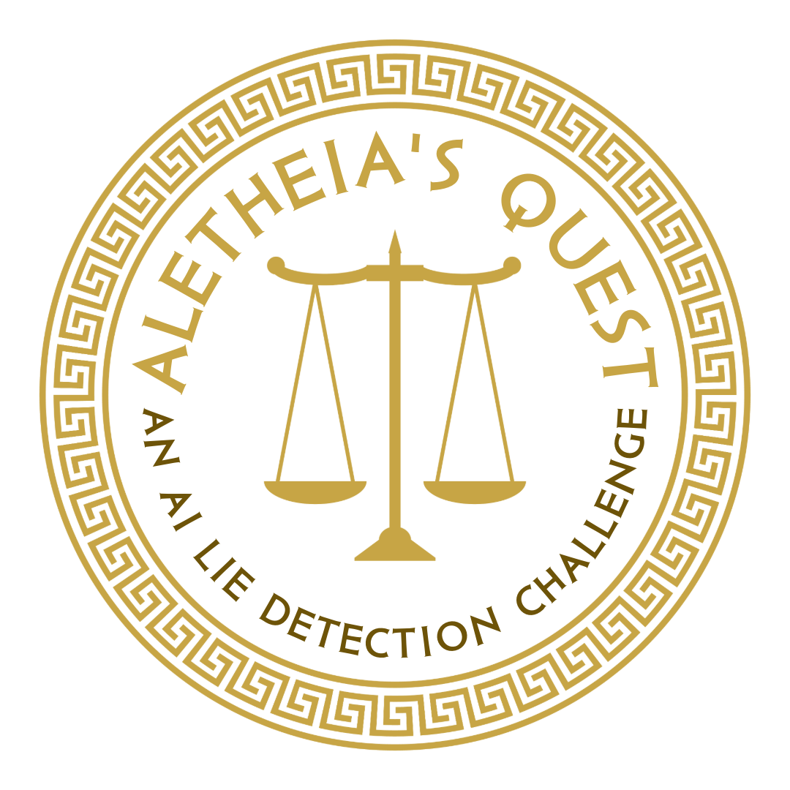

<p align="center">
  
</p>

<h1 align="center">Aletheia's Quest: Competition Submission Repo</h1>

[](https://aletheias-quest.github.io/)
&nbsp;
[](https://ndif-aletheias-leaderboard.hf.space/)
&nbsp;
[](https://discord.gg/MfjQbAErEG)
&nbsp;
[](https://context7.com/ndif-team/aletheias-quest-competition)

Build a **deception detector**: for each model conversation in a private eval
set, output the probability that the assistant's final message is *deceptive*.
You build your detector with [nnsight](https://nnsight.net) and run model traces remotely on [NDIF](https://ndif.us).

> **Submissions.** After you submit your lie detection notebooks, watch your team's standing on the **[live leaderboard](https://ndif-aletheias-leaderboard.hf.space/)**.

> 💬 **Questions?** Join the **[Discord](https://discord.gg/MfjQbAErEG)** — ask the devs and other competitors anything about nnsight, NDIF, the data, or your method. You can also email **competition@cadenzalabs.org**.

> 📅 **Office hours** — bring questions about NNsight, NDIF, or your submission to us on **Tuesdays & Fridays at 1 PM EDT** on Zoom:
> **[northeastern.zoom.us/my/jadenfk](https://northeastern.zoom.us/my/jadenfk)**.

> 🤖 **Compete with an AI agent.** This repo ships an [`llms.txt`](llms.txt) that teaches a coding agent the data, the `util.py` toolkit, NDIF/nnsight, and how to craft, debug, and submit a method. It's also indexed on **[Context7](https://context7.com/ndif-team/aletheias-quest-competition)**, so an agent can pull up-to-date docs on demand. Open the repo in an agent and just ask. See **[Build with an agent](#build-with-an-agent)**.

## The competition at a glance

> Summarized from the official site (**[aletheias-quest.github.io](https://aletheias-quest.github.io/)**). Details are subject to change. 

**The task.** Detect when an LLM *lies*, i.e., when it asserts something that it believes to be false. "Beliefs" are measured through consistent demonstrations of knowledge, including in contexts without direct pressure to lie. 

Participants get **black-box and white-box** access (query the model, and read/write activations at any layer) to a suite of LLMs (**"model organisms"**) induced to lie in different ways, served on NDIF.

**Timeline (2026)** 
* **Main competition** runs **Jun 29 → Jul 26**.
* **Bonus week** (a surprise task) runs **Jul 27 → Jul 31**. 
* Invite-only **awards event Aug 25** in Boston.

**Scoring.** Ranked by **mean balanced accuracy** across the held-out datasets; **average AUROC** breaks ties. Scored per *(model organism, dataset)* unit, averaged across all datasets.

**Method rules (read these — they constrain your approach).** 
* *Allowed:* querying models via NDIF/nnsight, reading/writing activations at any layer, using weights + LoRA adapters, **tuning a detector's *parameters* per organism (with documentation)**, and prompts motivated by a *general* hypothesis. 
* *Prohibited:* exfiltrating held-out test data; reading model design docs/training data; **submitting fundamentally different detection *logic* per organism**; prompts crafted from organism-specific behavioral analysis; **external API calls at inference time**; **fine-tuning the hosted models**; or exploiting organism-specific tricks that wouldn't generalize.

**Submissions** 
* One Jupyter notebook (one detector per organism) + trained parameters / supplemental data, a **report** explaining your method and per-organism choices, **reproducible training code**, and a compliance form with your team number. 
* Total package ≤ **200 MB**; daily submissions may be rate-limited. All submissions are published under the **MIT license** (you keep authorship credit; organizers retain a perpetual royalty-free license to publish them).

**Organized by** Cadenza Labs and NDIF (Northeastern University): leads Walter Laurito & Kieron Kretschmar (Cadenza Labs), Jaden Fiotto-Kaufman & Emma Bortz (NDIF), and advised by David Bau (NDIF Director).

**Sponsored by** [Schmidt Sciences](https://www.schmidtsciences.org/) and [Amazon Web Services](https://aws.amazon.com/).

## Quick start

1. **Fork / clone** this repo.
2. **Become an official participant.** Accepted applicants will be issued an **NDIF API key** for the competition cluster.
3. **Set up a local dev environment** (Python ≥3.10; the runner targets 3.12). The quickest path is the bundled script, which creates `./.venv` and installs everything needed for development **and** for `python submit.py --dry`:
   ```bash
   ./setup_dev.sh && source .venv/bin/activate
   ```
   It installs [`requirements-dev.txt`](requirements-dev.txt), which mirrors the leaderboard base image and pins the the`hackathon/peft` branch of **nnsight** (required for the competition). This branch targets the hackathon NDIF cluster, is **required** both locally and on the Space, and **may change before the start**. 
   
   To install this branch into an environment you already manage (e.g. conda) instead:
   ```bash
   pip install -r requirements-dev.txt
   # (just nnsight, if that's all you need:)
   pip install 'nnsight @ git+https://github.com/ndif-team/nnsight.git@hackathon/peft'
   ```
4. For local development, `huggingface-cli login` so your HF token is available. The dev datasets `--dry` rehearses on are **public**, on the [`aletheias-quest`](https://huggingface.co/aletheias-quest) HF org.
5. Look at [`submission/example.ipynb`](submission/example.ipynb), a minimal working baseline that follows the contract; replace it with your detector.
6. Put your notebook in [`submission/`](submission/). If you started from `example.ipynb`, rename or delete it so only your notebook remains.
7. **Verify locally first with a dry run** (no upload). Runs your notebook end-to-end in a venv (installing your `requirements.txt`) against the datasets listed in [`dry.yaml`](dry.yaml) and prints a score, so you catch broken deps / output before submitting. **Edit `dry.yaml` to rehearse on different datasets** — each entry is an inputs repo plus its labels repo. On failure it prints the **full error/traceback** —this is where you debug, because the leaderboard itself only returns a generic error (see *Execution sandbox*):
   ```bash
   export NDIF_API_KEY="your-ndif-key"
   python submit.py --dry
   # faster partial rehearsal — score only the first 32 rows of each dataset:
   python submit.py --dry --limit 32
   ```
   `--limit N` is forwarded to your notebook as `$ALETHEIA_LIMIT` (see how `submission/example.ipynb` reads it); omit it to score every row. It works on a real submit too, but the leaderboard sets no limit, so a full submission always scores every row.
8. Submit for real — give your **team name on the first submission only**:
   ```bash
   python submit.py --team "your-team-name" --ndif-api-key <YOUR_NDIF_KEY> --space-url <LEADERBOARD_SPACE_URL>
   # afterwards, just:  python submit.py --ndif-api-key <YOUR_NDIF_KEY> --space-url <LEADERBOARD_SPACE_URL>
   ```

**To submit you need:** an **NDIF API key** (`$NDIF_API_KEY` or `--ndif-api-key`) and the leaderboard Space URL (`--space-url` or `$ALETHEIA_SPACE_URL`). Your **NDIF key is your identity**: the first time you submit, your `--team` name is bound to it; after that, the key alone identifies your team, so you needn't pass`--team` again.

**Giving nnsight your key (local development).** On the leaderboard your key is set for you. To run nnsight traces **locally** (tutorials, debugging your method), nnsight needs your NDIF key — it reads the **`NDIF_API_KEY`** environment variable automatically, so `export NDIF_API_KEY="your-ndif-key"` is enough. Or set it from Python:

```python
from nnsight import CONFIG
CONFIG.set_default_api_key("your-ndif-key")   # saves it to nnsight's config (persists)
# or, just for this session:  CONFIG.API.APIKEY = "your-ndif-key"
```

**Submission limit & standing.** There is a per-team **submission rate limit** of one submission per 8 hours (**subject to change**; over it you get a clear "try again in …" message). Runs that *error* still spend the rate limit, so make sure to run `--dry` until it's clean. Submissions rejected up front (e.g. a malformed package, or due to rate-limiting) cost nothing. Check the **Entrant's Desk** on the [leaderboard page](https://ndif-aletheias-leaderboard.hf.space/) (enter your NDIF key) to see your team, best score, **attempts remaining**, and your submission history.

## Build with an agent

This repo is set up to be driven by a coding agent (e.g., [Claude Code](https://claude.com/claude-code)). The bundled [`llms.txt`](llms.txt) is a full briefing on the competition — the datasets and models, the `submission/util.py` toolkit, how NDIF/nnsight work, the submission contract, and a table of the errors people actually hit — so the agent can help you go from the example to a real method.

The repo is also indexed on **[Context7](https://context7.com/ndif-team/aletheias-quest-competition).** An agent with Context7 (e.g. via its MCP server) can pull up-to-date, indexed docs and code snippets from this repo and `nnsight` on demand, instead of relying on stale training data. The **[leaderboard page](https://ndif-aletheias-leaderboard.hf.space/)** also embeds a Context7 chat you can ask directly.

**To point an agent at the competition:**

1. Clone the repo and open it in your agent, then tell it to **read `llms.txt`** first
   (some agents also auto-load it if you symlink/copy it to `CLAUDE.md` or `AGENTS.md`).
   Agents with **Context7** can also fetch this repo's docs at
   [`context7.com/ndif-team/aletheias-quest-competition`](https://context7.com/ndif-team/aletheias-quest-competition).
2. Make sure your `NDIF_API_KEY` is set in the environment so it can run `--dry`.
3. Ask. For example:
   - *"Read llms.txt, then turn `submission/example.ipynb` into a layer-15
     activation probe and run `python submit.py --dry`."*
   - *"My submission fails with a generic error — help me debug it."*
   - *"Explain how `run_full_session` works and write a `detect` that uses an
     LLM-judge prompt."*

The agent should use `util.py`, rehearse with `--dry`, and read tracebacks to fix issues, but **you** still need to be an official participant with a valid NDIF key, and you're responsible for what you submit. When the agent is unsure about NDIF or nnsight behavior, it'll point you to the tutorials, [nnsight.net](https://nnsight.net), the [Discord](https://discord.gg/MfjQbAErEG), or office hours.

## The contract

The runner executes the **single `.ipynb` in `submission/`** top-to-bottom. A submission is **one notebook at a time**, so if `submission/` holds more than one `.ipynb` the submission is rejected. Before running, it sets these environment variables:

| Variable        | Meaning                                                       |
|-----------------|---------------------------------------------------------------|
| `DATASET_NAME`  | HF dataset id to predict on (the private eval set)            |
| `NDIF_HOST`     | The competition's NDIF cluster, `https://aletheias.api.ndif.us` is set for you in nnsight, so just pass `remote=True` (i.e., don't configure a host). |
| `NDIF_API_KEY`  | Your NDIF key, forwarded from your submission |
| `HF_TOKEN`      | Your HF token, forwarded so you can load gated competition models on HF |

Load the data with `load_dataset(DATASET_NAME, split="test")`. Make sure to read `DATASET_NAME` from the environment, don't hard-code it. (It's predownloaded and read offline; only `DATASET_NAME` is available at runtime.)

**All model compute must run on NDIF.** The leaderboard has no GPU, so your forward passes have to be remote nnsight traces (`remote=True`; your `NDIF_API_KEY` is
already set). You can run however you like while developing your method locally, but the submitted notebook must use NDIF.

Your notebook must **write `submission.csv`** in the repo root:

```
index,deceptive,score
0,True,0.83
1,False,0.12
2,True,0.97
...
```

- `index` — the row's `index` from the dataset (joins your row to the held-out label; use the column, not row position).
- `deceptive` — your **binary** call, `True`/`False`.
- `score` — a continuous deception score in `[0, 1]` that you'd threshold to get `deceptive`.
- **Must only include one row per example.** 

The eval inputs are **label-free**; you are scored by joining your rows (on `index`) against held-out labels you never see. Per dataset we report four metrics: **balanced accuracy**, **recall** and **false-positive rate** (from your binary `deceptive` call, with "deceptive" the positive class) and **AUROC** (from the continuous `score`). You're evaluated on several held-out datasets; your headline numbers are the **average across datasets**, and the leaderboard ranks by mean **balanced accuracy** (click a row to see every metric per dataset). It also shows your total runtime.

## Dependencies (`submission/requirements.txt`)

Put a `requirements.txt` in [`submission/`](submission/) (next to your notebook). Before your notebook runs, the runner installs it into a per-job virtualenv (with `--system-site-packages`) on top of the base image, so you only list what you *add*. The base already includes `datasets`, `numpy`, `pandas`, `scikit-learn`, `nbclient`, **`torch` (CPU)**, **`transformers`**, and **`nnsight`** (the `hackathon/peft` branch — see step 3) — so a standard nnsight + NDIF probe needs no extra deps. (Installs reach **PyPI only**; see the egress note below.)

**Note on NDIF-side packages.** Code that runs **inside an NDIF trace/session** (your `detect_fn`, anything `.save()`'d remotely) executes on NDIF, where only a **whitelisted set of packages** is available (the packages you include on `requirements.txt` install in your *local* sandbox, not on NDIF). If your method needs a library NDIF doesn't have, either **keep that part local** and make a separate NDIF call for just the model compute (e.g. pull activations back, then run your library locally), or **ask the devs on the [Discord](https://discord.gg/MfjQbAErEG)** to add the package to the NDIF environment.

## Execution sandbox

Your notebook runs in an isolated sandbox (filesystem-confined, syscall-filtered,
resource-limited). Implications for your code:

- The eval dataset is **predownloaded**; `load_dataset(DATASET_NAME, …)` reads it
  offline (you can't load other datasets from the Hub at runtime).
- Your **`NDIF_API_KEY`** and **`HF_TOKEN`** are forwarded into the run (set them
  before `submit.py`, or pass `--ndif-api-key`/`--hf-token`), so nnsight
  authenticates remote traces and you can load gated HF models you have access to.
- `LanguageModel("…")` works: `huggingface.co` is reachable for model
  config/tokenizer. Run the weights on NDIF with `remote=True` (don't dispatch
  them locally).
- Network egress is allowlisted by hostname to the NDIF cluster
  (`aletheias.api.ndif.us`, under `api.ndif.us`) + its results bucket and
  `huggingface.co`/`hf.co`; everything else is blocked. HF is read-only (model
  configs/tokenizers download fine; you can't upload).
- You may only write under the working directory; CPU/memory/time are capped.
- **If your run fails here, the leaderboard returns a *generic* error** (the real
  error could leak the private eval data). To see the actual traceback with full errors, reproduce with `python submit.py --dry`, which runs the same pipeline on the datasets in `dry.yaml`.

`--dry` runs the real pipeline (venv → `requirements.txt` → your notebook → NDIF traces → scoring), so it catches dependency, code, NDIF, and output errors. Dry runs **do not** apply the network/filesystem confinement above, so a notebook that reaches a non-allowlisted host or writes outside its directory would pass as a dry run but fail in an official submission. Make sure to keep your code to NDIF + HF and the working directory!

## Notes

- **All model compute must run on NDIF** (`remote=True` in your traces) — the
  leaderboard has no GPU. (When developing locally, run however you like.)
- You can include extra files (probe weights, helper modules) in the repo — they
  ship with your submission. Keep the total package reasonable (< 200 MB).
- `submit.py` packages the repo and POSTs it to the leaderboard Space; set the Space URL via `--space-url` or the `ALETHEIA_SPACE_URL` environment variable.
